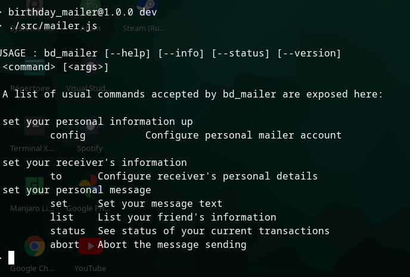

# Birthday Mailer : The console

## Purpose

This is a _Command line Interface_ tool made to let devs and console lovers to send automated birthday messages to
friends and relative on various canals.

### Targets

The tool is supposed to work by sending automated message to various applications from the command line.

    - Whatsapp
    - Telegram
    - Sms
    - Gmail

## Usage

For the moment our package is not fully deployed so it only works locally but you still have access to some script commands :

### Using npm:

* npm run dev

  To launch the home of the program where you can get many informations about the purpose and workflow of this tool.

### using legacy commands (Preferred option):

These commands are separated into two sets: configuration commands and default commands:

#### Default commands

* help
* info
* version
* status
* abort

#### Configuration commands

* config
* set
* to

## Installation

In order to benefit from birthsender services , you need to follow the steps below:

* 1 - Clone the repository 

            git clone https://github.com/Pericles001/repositories&name=birthsender

* 2- Enter the project directory

            cd birthday_mailer

* 3- Install dependencies

            npm install

* 4- Choose wether to use npm scripting commands or legacy commands from the program but we suggest you to use legacy commands since they were tested and optimized.

- With npm commands

            less package.json

- Read carefully script commands so you can use them further.

- With legacy commands

            cd src

- You can view files in the src folder via __ls__ or __tree__

            src
            ├── bots
            │   ├── gmail
            │   ├── sms
            │   ├── telegram
            │   └── whatsapp
            ├── commands
            │   ├── abort
            │   │   └── abort.js
            │   ├── configs
            │   │   ├── config.js
            │   │   ├── date
            │   │   │   ├── date.js
            │   │   │   ├── day.js
            │   │   │   └── month.js
            │   │   ├── email.js
            │   │   ├── list.js
            │   │   ├── msg
            │   │   │   └── msg.js
            │   │   ├── name.js
            │   │   ├── parameters.js
            │   │   ├── telegram.js
            │   │   └── whatsapp.js
            │   ├── defaults
            │   │   ├── default.js
            │   │   ├── help.js
            │   │   ├── info.js
            │   │   ├── status.js
            │   │   ├── unknown.js
            │   │   └── version.js
            │   ├── set
            │   │   └── set.js
            │   └── status
            │       └── status.js
            ├── mailer.js
            ├── storage
            │   ├── message
            │   ├── targetDate
            │   ├── targetInfos
            │   ├── targetMsg
            │   └── userInfos
            └── storer
            └── store.js

- The main file is __mailer.js__ , you can execute using :

    node mailer.js
    /** The second option is preferred to launch the program**/
    ./mailer.js

- The output will be a simple homepage which give most informations about commands :

    USAGE : bd_mailer [--help] [--info] [--status] [--version] 
    <command> [<args>]

    A list of usual commands accepted by bd_mailer are exposed here:

    set your personal information up
        config 	 Configure personal mailer account

    set your receiver's information
        to 	 Configure receiver's personal details
    set your personal message
        set 	 Set your message text
        list 	 List your friend's information
        status  See status of your current transactions
        abort 	 Abort the message sending

### Configuration

In order to send your birthmessage , you will need to pass some steps which are mandatory :

#### Setting up your personal informations

#### Setting up your friend personal informations

#### Setting up the message

#### Sending the message

## Contribute

In case you want to contribute in the project updates, you can do so :

### Contribution rules

* Follow the same coding style used in the js files (semistandard can also be used)
* Justify any change you have done into the project files
* Be patient in case you asked for review but have not been approved or even reviewed yet 

### Contribution tips

* Follow issues evolution in the repository menu, and ask to be assigned when you are interested or feel competent to resolve one
* In the repository menu , select the fork option
* Clone the repository that you have just forked
* Open the projet directory
* Work in the feature branch
* Select the contribute option into your forked repository menu
* Add a title and a description to your pull request using one of these prefixes depending of what you have done:

    
    Add/Edit/Update/Delete/Fix 

* Into description , cite each action you have made and mention affected files:

    -Subtitute default function by arrow function in index.js
    -Remove unused variable findErr in tests.js

* In case your pull request is related to an issue , add a reference to that issue in description

    Resolves #<issue number> 

## Author

__Pericles Adjovi__ : [Pericles001](https://github.com/Pericles001)

## License

Not defined yet

## Credits

Many resources have been helpful to do this project:

[StackOverFlow](https://stackoverflow.com) : Pretty helpful to face off with errors

[npm](https://npm.com) : Many packages that have been used were found there

__Project still in development__
